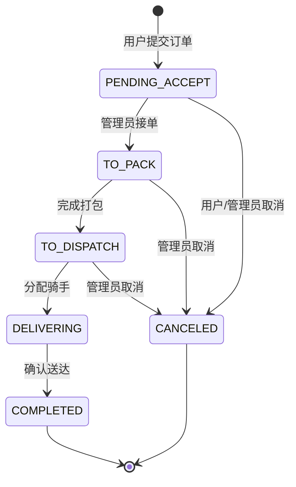
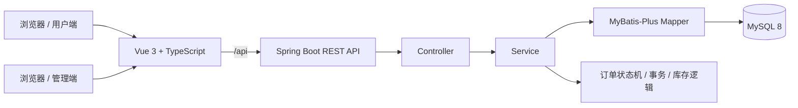

# 速安药房 · 单店药店即时配送管理系统

> 基于 Spring Boot 3 + Vue 3 + MyBatis-Plus + MySQL 构建的前后端分离课程设计项目，覆盖用户选药、购物车、地址、下单、订单状态追踪，以及后台药品、库存、订单、骑手、用户与经营数据看板管理。

## 项目简介

“速安药房”是一个面向单店药房场景的即时配送管理系统。项目并不追求模拟大型医药电商平台，而是以一个清晰、完整、可运行的业务闭环为目标，重点练习 Java Web 分层开发、前后端分离、数据库建模、事务处理、库存一致性、订单状态机、权限边界与管理端数据可视化等能力。

当前项目包含两个主要端：

- **用户端**：注册登录、药品浏览与搜索、分类筛选、购物车、收货地址、订单创建、订单查询与取消。
- **管理端**：经营数据看板、药品分类、药品与库存、订单履约、骑手、用户状态管理。

> **说明：** 本项目为学习/课程设计用途，不是实际线上医疗服务系统。示例药品、账号和业务数据仅用于本地演示。

## 核心功能

### 用户端

- 用户注册、登录、退出与会话保持
- 药品分类展示
- 药品列表、关键词搜索、详情查看
- 购物车商品添加、数量修改、勾选、删除
- 无效购物车商品清理
- 收货地址新增、修改、删除、默认地址设置
- 从购物车选中商品创建订单
- 用户订单分页查询与详情查看
- 待接单阶段自主取消订单
- 查看订单金额、配送信息与状态变化记录

### 管理端

- 控制中心 / Dashboard
  - 今日订单数
  - 今日销售额
  - 待处理订单数
  - 库存预警数
  - 订单趋势
  - 销售趋势
  - 分类销售分布
  - 热销药品榜
- 药品分类管理
- 药品 CRUD、上下架与库存调整
- 低库存预警查询
- 订单分页筛选与详情查看
- 接单、打包、分配骑手、完成配送、取消订单
- 骑手新增、修改、启停与可用骑手查询
- 用户列表与账号启停

## 订单状态机

项目没有将订单状态简单设计成“任意修改字段”，而是通过显式状态机约束合法流转：



对应状态：

| 状态 | 含义 |
|---|---|
| `PENDING_ACCEPT` | 待接单 |
| `TO_PACK` | 待打包 |
| `TO_DISPATCH` | 待派送 |
| `DELIVERING` | 配送中 |
| `COMPLETED` | 已完成 |
| `CANCELED` | 已取消 |

订单取消时会恢复对应药品库存；每一次状态变化都会写入订单状态日志，便于追踪订单履约过程。

## 技术栈

### 后端

- Java 17
- Spring Boot 3.5.15
- Spring MVC
- Jakarta Validation
- MyBatis-Plus 3.5.16
- MySQL 8.x
- Maven
- Lombok
- JUnit / Spring Boot Test
- HttpSession 会话认证

### 前端

- Vue 3.5
- TypeScript 5.7
- Vite 6
- Vue Router 4
- Pinia 2
- Axios
- Element Plus
- ECharts 5

## 系统架构



前端开发服务器默认运行在 `http://localhost:5173`，通过 Vite 代理将 `/api` 请求转发到后端 `http://localhost:8089`。

## 项目目录

```text
pharmacy-delivery-system/
├─ backend/                    # Spring Boot 后端
│  ├─ src/main/java/com/pharmacy/
│  │  ├─ common/              # 统一响应、错误码、分页模型
│  │  ├─ config/              # MyBatis-Plus、Web 配置
│  │  ├─ controller/          # REST Controller
│  │  ├─ dto/                 # 请求 DTO
│  │  ├─ entity/              # 数据库实体
│  │  ├─ enums/               # 用户角色、订单状态等
│  │  ├─ exception/           # 业务异常与全局异常处理
│  │  ├─ interceptor/         # 登录/权限拦截
│  │  ├─ mapper/              # MyBatis-Plus Mapper
│  │  ├─ service/             # Service 接口与实现
│  │  ├─ util/                # Session、订单号、状态机工具
│  │  └─ vo/                  # 返回 VO
│  └─ src/test/               # Controller / Service / 状态机测试
├─ frontend/                   # Vue 3 前端
│  ├─ public/images/          # 分类与药品演示图标
│  └─ src/
│     ├─ api/                 # Axios 与接口封装
│     ├─ components/          # 通用组件
│     ├─ layouts/             # 用户端 / 管理端布局
│     ├─ router/              # 路由与前端访问控制
│     ├─ stores/              # Pinia 状态管理
│     ├─ types/               # TypeScript 类型
│     ├─ utils/               # 工具函数
│     └─ views/               # 用户端与管理端页面
├─ database/
│  └─ pharmacy_delivery.sql   # MySQL 初始化脚本
├─ scripts/                   # Windows / Linux 启动脚本
├─ .gitignore
└─ README.md
```

## 数据库设计

项目当前包含 9 张核心业务表：

1. `sys_user`：用户与管理员账号
2. `medicine_category`：药品分类
3. `medicine`：药品与库存
4. `user_address`：用户收货地址
5. `delivery_rider`：配送骑手
6. `shopping_cart`：购物车
7. `pharmacy_order`：订单主表
8. `pharmacy_order_item`：订单明细
9. `order_status_log`：订单状态变更日志

设计中使用了唯一索引、普通索引、外键、检查约束与逻辑删除字段，并将订单主表与订单明细拆分，避免重复存储订单级信息。

## 关键实现亮点

### 1. 订单状态机

通过 `OrderStatus` 枚举定义合法状态迁移，`OrderStateMachine` 统一判断状态是否允许流转，避免管理员通过接口将订单直接跳转到任意状态。

### 2. 下单事务与库存扣减

创建订单时在事务中完成：

1. 校验地址归属
2. 校验购物车归属
3. 查询药品状态
4. 扣减库存
5. 计算商品金额与配送费
6. 创建订单主表
7. 创建订单明细
8. 写入初始状态日志
9. 删除已下单购物车记录

任一步骤发生异常时通过事务回滚，降低“订单生成但库存未同步”等数据不一致问题。

### 3. 取消订单自动回补库存

订单在允许取消的阶段被取消后，根据订单明细恢复各药品库存，并记录取消原因、操作者及状态变化。

### 4. 用户数据权限边界

地址、购物车和订单相关操作会基于当前登录用户 ID 校验资源归属，避免用户直接通过修改路径参数访问其他用户的数据。

### 5. 管理端数据看板

通过 ECharts 展示订单、销售额、分类分布和热销药品等指标，使系统不仅具备 CRUD 页面，也具备基础经营数据观察能力。

### 6. 统一接口与异常处理

后端使用统一 `ApiResponse` 返回结构，并通过业务异常、错误码与全局异常处理统一前后端错误语义。

## 本地运行

### 环境要求

建议环境：

- JDK 17+
- Maven 3.9+
- MySQL 8.x
- Node.js 20+
- npm 10+

### 1. 初始化数据库

先创建/导入数据库：

```bash
mysql -u root -p < database/pharmacy_delivery.sql
```

或者在 DataGrip / Navicat / MySQL Workbench 中执行 `database/pharmacy_delivery.sql`。

> 初始化脚本会删除并重新创建 `pharmacy_delivery` 数据库，请不要对生产数据库执行。

### 2. 配置数据库连接

推荐通过环境变量提供数据库密码，不要将个人数据库密码提交到 GitHub：

```yaml
spring:
  datasource:
    url: ${DB_URL:jdbc:mysql://localhost:3306/pharmacy_delivery?useUnicode=true&characterEncoding=utf8&useSSL=false&serverTimezone=Asia/Shanghai&allowPublicKeyRetrieval=true}
    username: ${DB_USERNAME:root}
    password: ${DB_PASSWORD:}
```

Windows PowerShell 示例：

```powershell
$env:DB_PASSWORD="你的MySQL密码"
```

### 3. 启动后端

```bash
cd backend
mvn spring-boot:run
```

后端地址：`http://localhost:8089`

### 4. 启动前端

另开一个终端：

```bash
cd frontend
npm install
npm run dev
```

访问：`http://localhost:5173`

## 演示账号

数据库初始化脚本包含本地演示账号：

| 角色 | 账号 | 密码 |
|---|---|---|
| 管理员 | `admin` | `123456` |
| 普通用户 | `user01` | `123456` |
| 普通用户 | `user02` | `123456` |

> 这些账号仅为课程演示数据。当前版本按课程设计要求使用明文密码实现认证，**绝不能作为生产环境认证方案**。如果继续演进项目，应改为 BCrypt/Argon2 等单向密码哈希，并进一步完善 Spring Security、CSRF、鉴权与审计机制。

## 测试

当前代码包含以下方向的测试：

- 登录注册 Controller
- 公共药品查询 Controller
- 用户地址 Controller
- 用户购物车 Controller
- 用户订单 Controller
- Auth Service
- Cart Service
- OrderStateMachine

运行：

```bash
cd backend
mvn test
```

## 已知限制

当前版本定位为课程设计与 Java 全栈业务练习，因此仍存在以下有意保留或尚未实现的生产级能力：

- 密码目前为明文演示实现
- 认证采用 HttpSession，未引入完整 Spring Security 体系
- 未实现真实支付
- 未接入地图、真实配送轨迹与第三方骑手平台
- 未实现短信验证码
- 药品内容为演示数据，不构成医疗建议
- 未实现处方药审核、药师审方等真实医药合规流程
- 未实现 Redis 缓存、MQ、分布式事务等高并发架构

这些限制也构成后续持续迭代的方向。

## 后续计划

- [ ] 使用 BCrypt 完成密码哈希升级
- [ ] 引入 Spring Security 完善认证与授权
- [ ] 增加 OpenAPI / Swagger 接口文档
- [ ] 增加订单并发扣库存测试
- [ ] 增加数据库迁移工具（Flyway / Liquibase）
- [ ] 完善 Docker / Linux 部署方案
- [ ] 增加更多 Service 与 Controller 自动化测试
- [ ] 增加项目截图和演示 GIF
- [ ] 将业务设计与开发复盘整理到“星雨笔录”

## 项目定位

这个项目更适合作为：

- Java 全栈课程设计作品
- Spring Boot + Vue 前后端分离练习
- 数据库与业务建模练习
- 订单状态机、库存事务与后台管理系统实践

它不是生产级医疗系统，也不应以真实在线药房的名义直接部署运营。

## 作者

- 个人知识站：**星雨笔录** — `https://yulanlin.cn`
- 项目类型：Java 全栈学习 / 课程设计 / 作品集项目

---

如果这个项目对你有参考价值，欢迎通过 Issue 交流实现思路。
