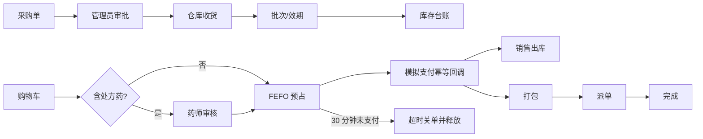

# 速安药房 V2

单店药房采购、批次库存、处方审核、交易与即时履约的一体化教学 / 秋招作品集系统。

> 本项目只使用虚构药品、处方、用户与支付数据，不提供真实药品服务，不接诊疗、医保或真实支付，也不声称满足医疗生产合规。

## 可证明的工程能力

- Java 17、Spring Boot 3.5.16、Spring MVC、MyBatis-Plus、MySQL 8、Flyway。
- Spring Security 6、BCrypt、短期 JWT、HttpOnly Refresh Token 轮换与重放撤销、角色路由权限。
- 采购审批 / 部分收货、批号和效期、历史库存隔离、FEFO 多批次预占、释放与只追加库存台账。
- 处方内容检测与私有存储、药师审核、模拟支付幂等、明确订单状态机。
- Spring Modulith JDBC 领域事件登记、RabbitMQ Publisher Confirm、TTL/DLX 超时关单、消费 Inbox。
- Redis 失败不影响核心交易正确性；Redisson 仅作为可选协调加速。
- OpenAPI、Actuator、Prometheus 指标、Trace ID、JUnit/Mockito、GitHub Actions、Linux systemd/Nginx。

它不覆盖算法能力、JVM/并发原理学习、真实微服务、Spring Cloud、Kubernetes、Elasticsearch、真实高流量与团队经历。详见 [架构与边界](docs/architecture.md)。

## 核心流程



## 本地运行

要求 JDK 17、Maven 3.9、MySQL 8、Redis、RabbitMQ、Node.js 22。全项目不使用 Docker。

1. 创建空数据库 `pharmacy_delivery`。应用启动时由 Flyway 自动建表；不要再执行旧的破坏性 `database/pharmacy_delivery.sql`。
2. 设置环境变量。至少应设置数据库口令和随机 JWT 密钥：

```powershell
$env:DB_USERNAME="pharmacy_app"
$env:DB_PASSWORD="你的数据库密码"
$env:JWT_SECRET="至少32字节的随机字符串，请勿提交"
$env:MESSAGING_ENABLED="true"
```

3. 启动后端和前端：

```powershell
cd backend
mvn spring-boot:run

cd ../frontend
npm ci
npm run dev
```

访问 `http://localhost:5173`。OpenAPI 位于 `http://localhost:8089/swagger-ui.html`，健康检查为 `/actuator/health`。

旧库首次启动时，旧明文密码会在启动事务中一次性 BCrypt 化；任意转换失败会终止启动。旧 `medicine.stock` 会进入 `LEGACY_UNKNOWN` 隔离批次且清零可售聚合库存，仓库人员补录真实批号与效期后才可销售。

## 质量验证

```powershell
cd backend
mvn verify

cd ../frontend
npm ci
npm audit --audit-level=high
npm run build
```

CI 在 Ubuntu Runner 原生启动 MySQL、Redis、RabbitMQ，运行测试、Flyway 空库启动冒烟和前端构建。部署模板见 `deploy/`。

## 文档

- [开发与验收台账](docs/development-plan.md)
- [架构、状态机与正确性边界](docs/architecture.md)
- [成品仓库代码级参考审计](docs/reference-audit.md)

原始重新审计升级计划仍只存在于用户原工作区，创建本分支时未复制或自动提交。

当前分支优先交付可解释、可测试的模块化单体。退款、盘点对账、真实 MySQL 并发压测、故障演练和浏览器 E2E 属于下一质量里程碑；在证据产生之前不写入简历的“已完成能力”。
