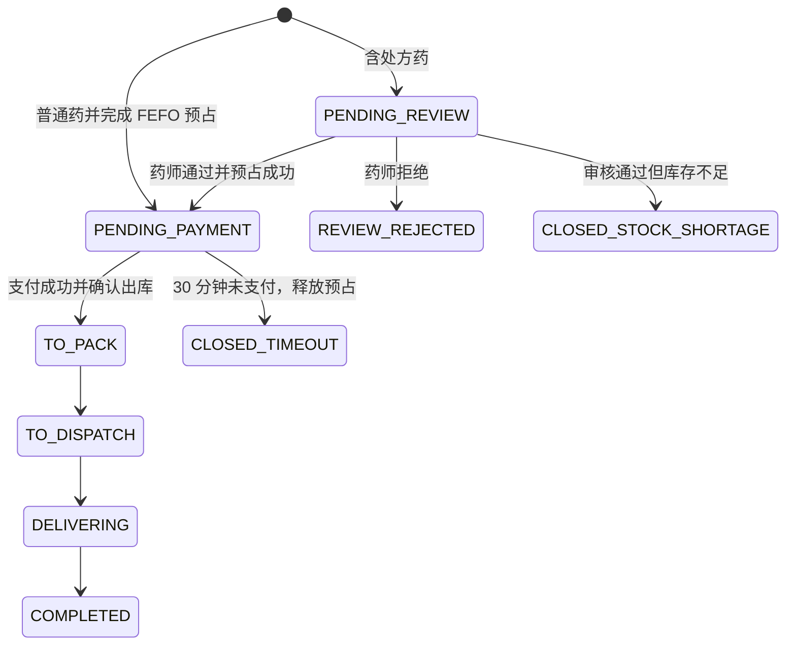

# 速安药房 V2 架构与业务不变量

## 定位与边界

单店药房采购、批次库存、处方审核、交易与即时履约的教学 / 求职作品集系统。只使用虚构数据，不接诊疗、医保、真实支付或真实患者信息，也不宣称达到医疗生产合规。

## 核心状态

## 正确性边界

- Redis 是缓存和可选协调加速，不承担订单、令牌轮换或库存的最终正确性。
- 同一用户下单先锁定 `sys_user` 行，再检查 `(user_id,idempotency_key)` 唯一键，重复请求返回同一订单。
- 库存按 `expiry_date,id` 排序并锁行；批次数量有 Check 约束，更新语句再次检查非负。
- 领域事件与业务事务由 Spring Modulith JDBC 一起提交；RabbitMQ Nack / 超时不会完成事件登记，恢复后重放。
- 消费者先写 `(consumer_name,event_id)` 唯一 Inbox，再处理业务，数据库提交后才 Ack。
- 处方文件不在前端或后端静态目录，下载时隐藏越权资源是否存在。

## 明确的岗位差距

本项目不实现 Spring Cloud、Kubernetes、Elasticsearch 或伪造亿级流量。Java/JVM、操作系统、网络、算法题仍须独立学习；架构内容不能替代实习和真实团队经验。
