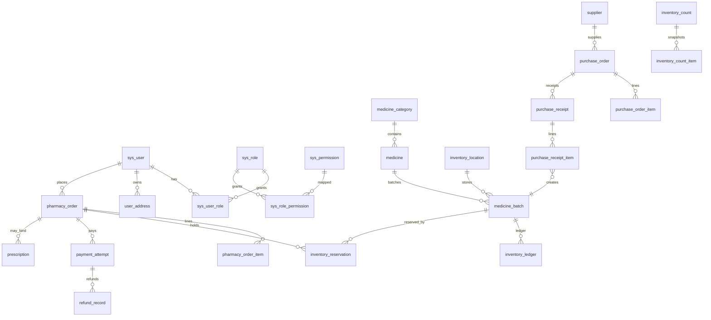

# 逻辑 ER（核心表）

与 Flyway V1～V5 一致。`medicine.stock` 不是可编辑主数据。

## 不变量

- `inventory_ledger` 只插入，不更新、不删除
- `purchase_order_item`：`received_qty <= ordered_qty`
- `medicine_batch`：`available_qty >= 0 AND reserved_qty >= 0`
- 历史遗留批次 `LEGACY_UNKNOWN` 隔离且不可售，直到仓库收合格批次
