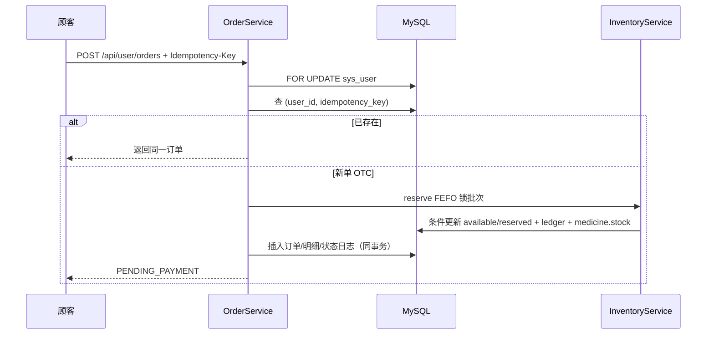
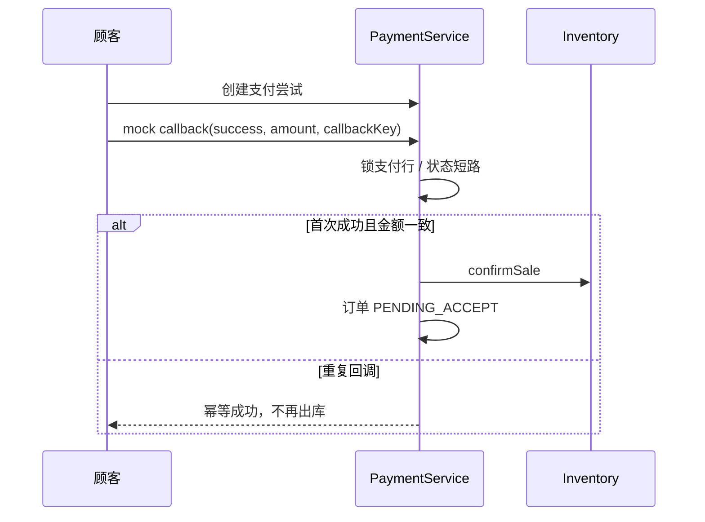
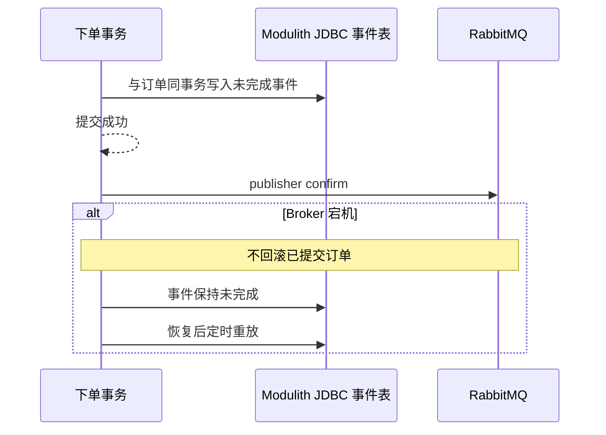
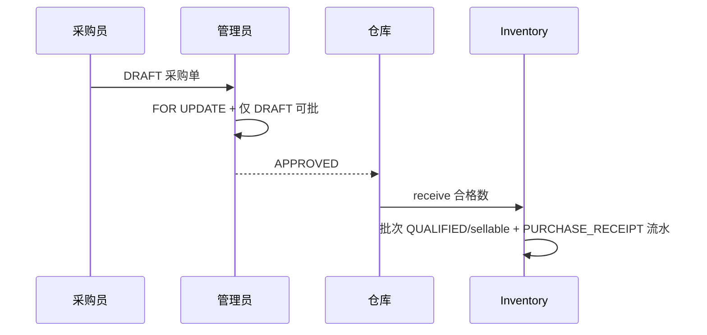

# 关键时序

## 下单幂等与预占

```mermaid
sequenceDiagram
  participant U as 顾客
  participant API as OrderService
  participant DB as MySQL
  participant Inv as InventoryService
  U->>API: POST /api/user/orders + Idempotency-Key
  API->>DB: FOR UPDATE sys_user
  API->>DB: 查 (user_id, idempotency_key)
  alt 已存在
    API-->>U: 返回同一订单
  else 新单 OTC
    API->>Inv: reserve FEFO 锁批次
    Inv->>DB: 条件更新 available/reserved + ledger + medicine.stock
    API->>DB: 插入订单/明细/状态日志（同事务）
    API-->>U: PENDING_PAYMENT
  end
```

## 模拟支付回调

```mermaid
sequenceDiagram
  participant U as 顾客
  participant Pay as PaymentService
  participant Inv as Inventory
  U->>Pay: 创建支付尝试
  U->>Pay: mock callback(success, amount, callbackKey)
  Pay->>Pay: 锁支付行 / 状态短路
  alt 首次成功且金额一致
    Pay->>Inv: confirmSale
    Pay->>Pay: 订单 PENDING_ACCEPT
  else 重复回调
    Pay-->>U: 幂等成功，不再出库
  end
```

## RabbitMQ 不可用时

```mermaid
sequenceDiagram
  participant T as 下单事务
  participant Out as Modulith JDBC 事件表
  participant MQ as RabbitMQ
  T->>Out: 与订单同事务写入未完成事件
  T-->>T: 提交成功
  T->>MQ: publisher confirm
  alt Broker 宕机
    Note over T,MQ: 不回滚已提交订单
    T->>Out: 事件保持未完成
    T->>Out: 恢复后定时重放
  end
```

## 采购审批到收货

```mermaid
sequenceDiagram
  participant P as 采购员
  participant A as 管理员
  participant W as 仓库
  participant Inv as Inventory
  P->>A: DRAFT 采购单
  A->>A: FOR UPDATE + 仅 DRAFT 可批
  A-->>W: APPROVED
  W->>Inv: receive 合格数
  Inv->>Inv: 批次 QUALIFIED/sellable + PURCHASE_RECEIPT 流水
```
