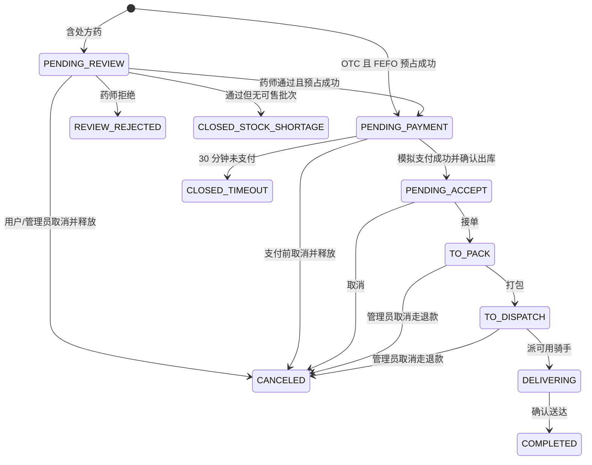
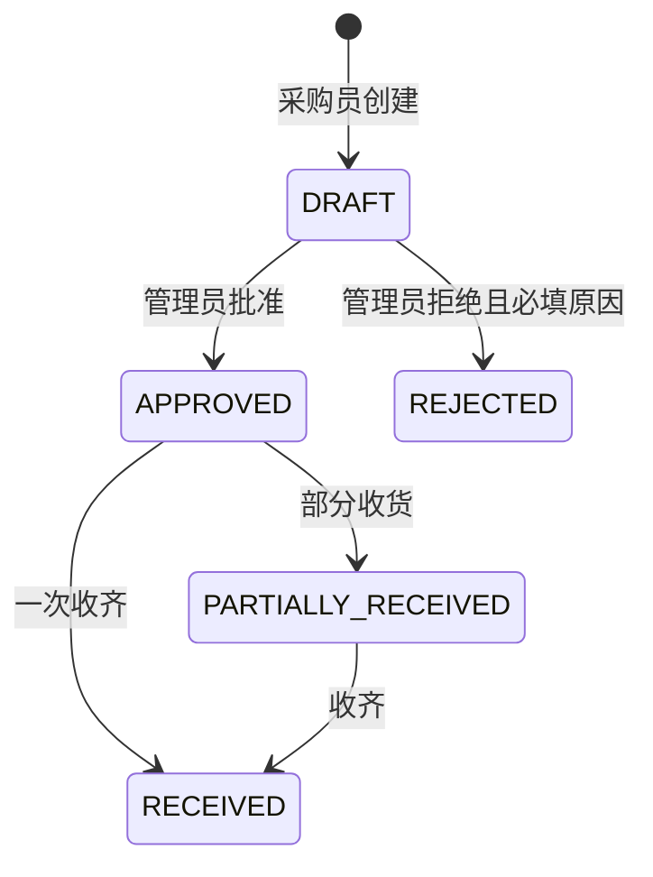
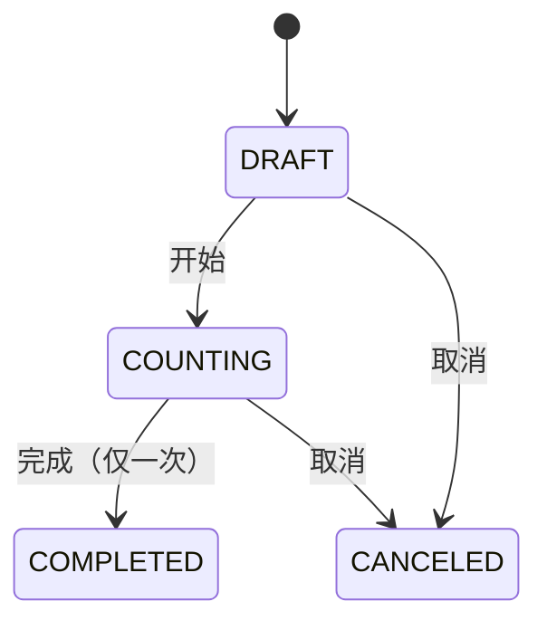

# 状态机

订单主路径见 [architecture.md](architecture.md)。此处补采购与盘点，以及订单取消/退款边界。

## 订单

退款：发货前状态才回补库存；配送中/已完成不得错误回补。以 `RefundService` 的 `restockRequired` 为准。

## 采购单

批准不入库。合格收货才增加可售批次与 `PURCHASE_RECEIPT` 流水。

## 盘点单

